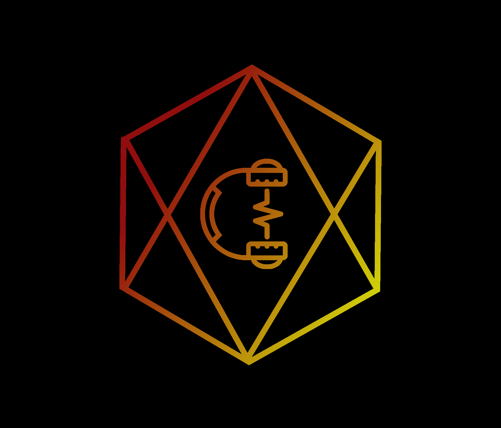
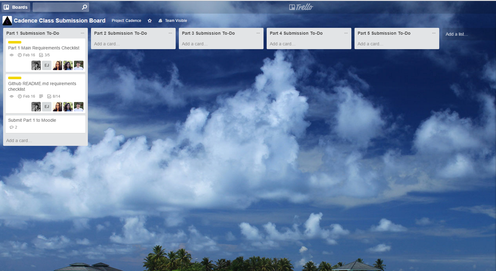
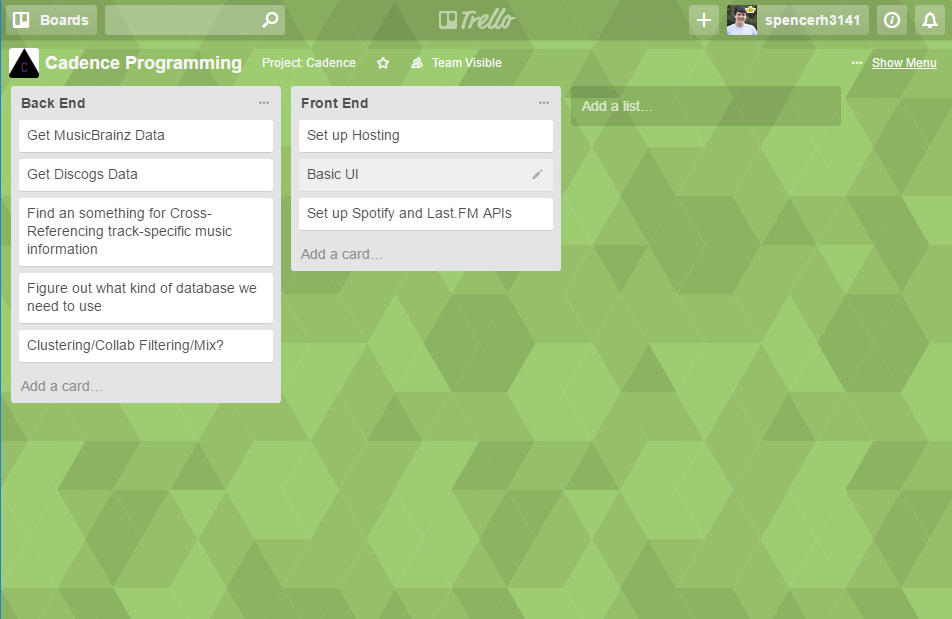

Software development class project for CSCI 3308 at Colorado University of Boulder

## Team Members
* <a href="https://github.com/spencer-hanson">Spencer Hanson</a>
* <a href="https://github.com/jessalbarian">Jessie Albarian</a>
* <a href="https://github.com/icarly10910">Carly Romig</a>
* <a href="https://github.com/ejames917">Evan James</a>
* <a href="https://github.com/abrande">Sophie Brande</a>

## Description
Gather information about a user’s listening history to provide a visualization of their top tracks and artists, and create playlists of new songs and bands based on their listening history found through a machine learning algorithm.

## Vision statement
Cadence strives to connect music lovers and artists to expand their musical palate. Cadence provides inspiring visualizations that fit your music niche, and personalized playlists so you can get the most out of your musical experience. 

## Motivation
Cadence allows us to learn new skills in both designing, frontend, and backend web development. It gives experience working with public API's such as the Spotify and last.fm API's, Angular.js framework, Python and JavaScript, and to expand our personal Spotify library.   

## Risks
* Learning new languages and frameworks 
* Figuring bugs between how each team member's code interacts
* Learning how to use Github properly
* Machine learning
* Working on a project with new people who communicate differently

## Mitigation Strategy

Many of us in the project have different skillsets. If some of us know more about a certain part of the project we can help each other learn what we know. Additionally we can reach out to our sources to make sure we understand what we're programming and can overcome any "walls" we may hit. 

Paired programming can help mitigate some level of bugs during the project, and maintaining open communication during the project in order to straighten out how the project is being programmed. 

## List of requirements

ID: 1

* As a user, I want to play songs so that I can listen to music
* Story Points: 3
* Area: Front End

ID: 2

* As a user, I want to log in so that I can view my dashboard
* Story Points: 4
* Area: Front End & Back End

ID: 3

* As a user, I want to register an account so that I can log in
* Story Points: 3
* Area: Front End & Back End

ID: 4

* As a user, I want to like a song so that I can show my specific music interests 
* Story Points: 4
* Area: Front End 

ID: 5

* As a user, I want to customize my user profile's bio so that it's personalized to me specifically.
* Story Points: 2
* Area: Front End & Back End

ID: 6

* As a user, I want to upload a picure so that I can have a more personalized user profile.
* Story Points: 2
* Area: Front End & Back End

## Methodology

We will be using Agile processes as our methodology. This means that we will execute our goals and tasks continuosly and in sprints, compared to the waterfall method. This way we will be as efficient as possible whilst also achieving more tasks at a faster rate. By using Agile, we will be using Agile sizing to rate our tasks to dictate top priorities.

## Project Tracking software

## Project Plan

 

## Auto-documenter

The auto-documenter script is named "docs.sh" and lives in Cadence/backend. In the script, it will create a directory names "docs" if it does not exist and then run pydoc on all python files in the "apis" directory. The .html files which are produced will then be moved from Cadence/backend to the Cadence/backend/docs directory.

## Github Repo Navigation
We split up our Cadence repository into the different sections of our project. We have three main folders; backend, CadenceWebsite, and media.

The backend folder was created for all backend functionality. (insert in-depth backend explanation here)

For our frontend, we created a folder named “CadenceWebsite” which focuses on the website’s frontend layout, design, and functionality. Inside the folder we have our app.js file that makes all of the api calls, using Node.js/Express.js, that we use for authentication and getting further user information.

We send this data to our main home.html file where we grab the access token and refresh token to send to our backend server. Within the home.html file, located in the public directory, we create the iframe for the new playlist sent from our backend server. We also recieve all the user information gained from the api calls made in app.js and programmatically populate the page with the user’s playlists and information.

Our public directory also contains other .html files for the D3 graph, about, profile, and login page. Cadence is designed primarily with HTML/CSS, Bootstrap, and JavaScript/JQuery. All this is within their designated folder within the public directory as well as “assets” which holds all pictures used for our website.

Our media folder contains miscellanous items, such as pictures of our Trello and our team logo.

## CI system
We used Travis CI for our CI system. https://travis-ci.com/spencer-hanson/Cadence

