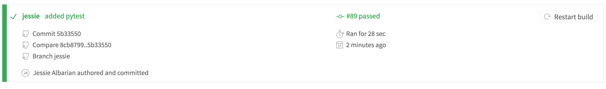
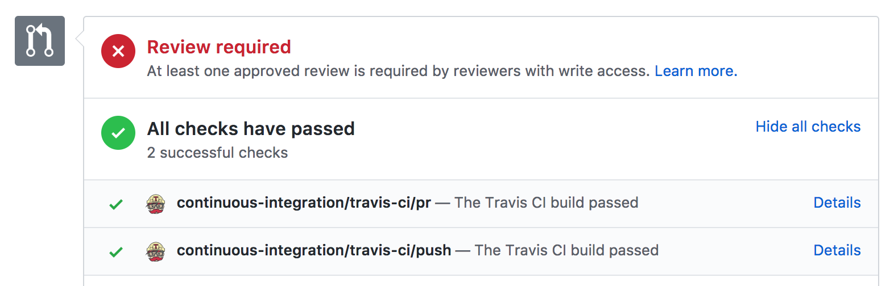
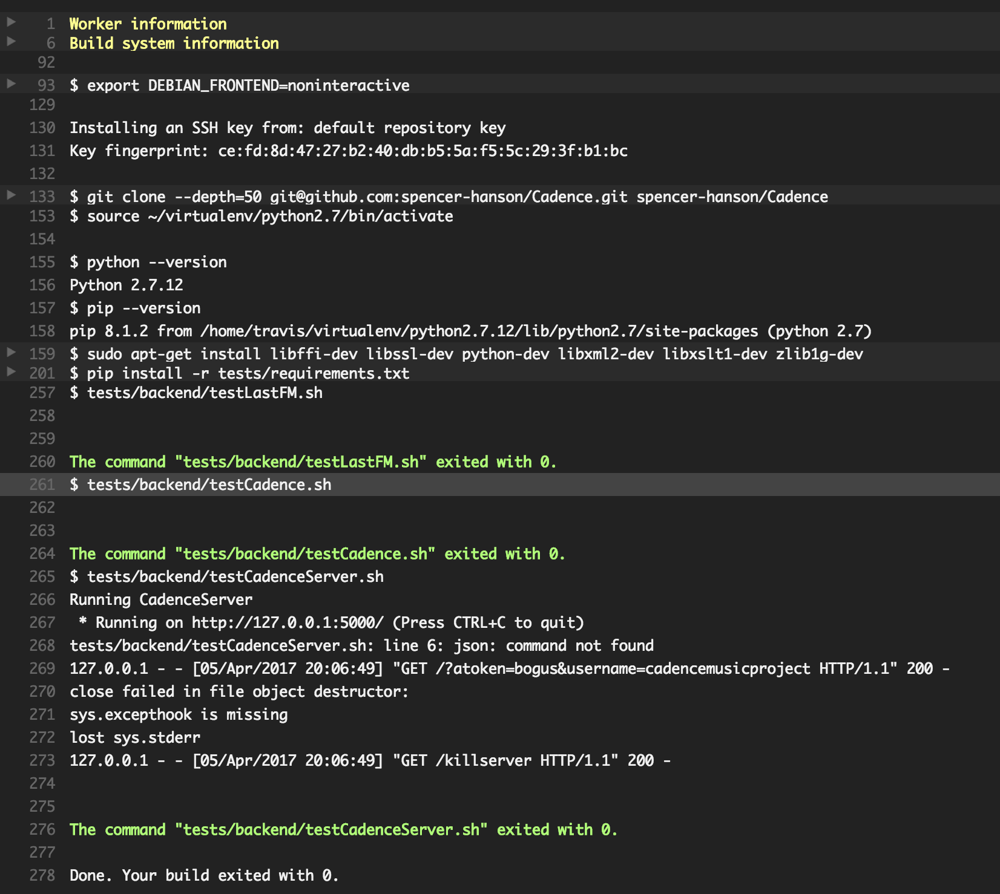

## Team Members
* <a href="https://github.com/spencer-hanson">Spencer Hanson</a>
* <a href="https://github.com/jessalbarian">Jessie Albarian</a>
* <a href="https://github.com/icarly10910">Carly Romig</a>
* <a href="https://github.com/ejames917">Evan James</a>
* <a href="https://github.com/abrande">Sophie Brande</a>

## Title of Project: Cadence

## Vision
Cadence strives to connect music lovers and artists to expand their musical palate. Cadence provides inspiring visualizations that fit your music niche, and personalized playlists so you can get the most out of your musical experience.

## Automated Tests

Explanation: We are using Travis-CI for automated testing. It is linked with our Github repo and passes or fails commits when we do pull requests into master. We are able to see if our tests are passing through Github. The testLastFm.py checks to make sure our script can use all of the Last FM API functions correctly. Our tests are currently all passing.

## User Acceptance Tests
* UAT #1: Use case name: Login
  * Description: You will be going through the login feature we have implemented for Cadence that gets you through to the Cadence login and the Spotify login
  * Pre-conditions: User has access to website
  * Test steps:
    * Navigate to the proper URL of our web page
    * Click on the login button
    * Login to Spotify using Facebook or your Spotify login information
  * Expected result: User should be able to login successfully
  * Actual result: User is navigated to main page with sucessful login
  * Status: Pass
  * Questions/Notes:
    * Is the main login page user friendly?
    * Were you able to successfully login with the test username and password?
    * Did the login redirect you to the Spotify login?
  * Post-conditions: User is validated through the Spotify authentication and is signed into their account. Their account details are stored into a database.

* UAT #2: Use case name: Main Page
  * Description: You will go through the main page of Cadence to see your music recommendations.
  * Pre-conditions: User has logged in successfully
  * Test steps:
    * Open up the main page
    * View the music recommendations
    * View the navigation bar and the links provided
    * View the button to generate the playlist
  * Expected result: User should be able to see the music recommendations properly and be able to see the design of the main page
  * Actual result: User is able to see music playlists
  * Status: Pass
  * Questions/Notes:
    * Is the main page design easy to navigate?
    * After you logged in, did the main page show you music recommendations?
    * Was the navigation bar easy to understand?
    * Was the navigation bar working when you clicked on each of the links?
  * Post-conditions: Our recommendation script is ran to display the playlist, and the spotify access token gave us access to their music.

* UAT #3: Use case name: Visualizations
  * Description: You will navigate to the visualizations section of Cadence.
  * Pre-conditions: User has logged in successfully
  * Test steps:
    * Navigate to the navigation bar and click on visualizations
    * View the visualizations based on music playlists
  * Expected result: User should be able to see a visualization of their music
  * Actual result: User is unable to see visualizations
  * Status: Fail because we have not added this feature yet
  * Questions/Notes:
    * Were you able to find the visualizations section of the website from the navigation bar?
    * Was the link working correctly?
    * Were you able to see the visualizations on the page?
  * Post-conditions: None
